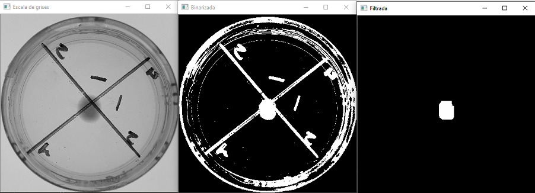

# Cultivo_Fungi :octocat:
Este repositorio va destinado al análisis del modelo de crecimiento de hongos mediante visión artificial 

# Como descargar las librerías necesarias para compilar el código
Copie y pegue cada una de los siguientes comandos en el CMD (Símbolo del sistema) ingresando los comandos línea por línea solo una a la vez:

python -m pip install -U pip

python -m pip install --upgrade pip

pip install opencv-python

pip install pandas

pip install openpyxl

#### Autor: Sergio Beleño :octocat: ✒️
